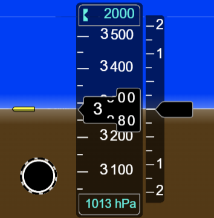

# 📘 Modèle d’évolution d’une question – du .docx source à l’instructeur/élève

Ce fichier présente de manière illustrée l’évolution d’une question depuis le format `.docx` structuré jusqu’à ses déclinaisons finales pour les documents instructeur et élève.

---

## 📄 Fichier `.docx` linéaire source (structure de base)

> 💡 Ce format est maintenu par l’auteur, avec numérotation manuelle, balises, images, etc.

```
Titre     00-2-04
Thème     Lecture de l’altimètre
Version   01.03
Date      20-01-2025
Auteur    JC

#Q######################################################

Question 00-2-04-Q001
Version Q 1.01
Référence du cours: BAK 000 2.2

Quelle est la pression de référence réglée sur l’instrument et quelle est l’altitude indiquée par l’altimètre ?

#PICT003# [image: 00-2-04-défi-fd_image003.png] #PICTHeight=4.0

#A------------------------------------------------------

#- [type:text] La pression de référence réglée sur l'altimètre est de 1013 hPa, l'altitude indiquée est 3290 ft. 
Le réglage est probablement le QNE. L'avion est au niveau de vol FL33.
Altitude indiquée 3290 ft au-dessus de l’isobare 1013 hPa -#
```

---

## 🧑‍🏫 Version générée : Document Instructeur

```
Titre        : 00-2-04
Thème        : Lecture de l’altimètre
Version      : 01.03
Date         : 20-01-2025
Auteur       : JC

=============================================================================

Question 00-2-04-Q001        Version 1.01
Référence du cours: BAK 000 2.2

Quelle est la pression de référence réglée sur l’instrument et quelle est l’altitude indiquée par l’altimètre ?

[Image insérée ici, hauteur = 4.0 cm]

#############################################################################

Réponse corrigée :

La pression de référence réglée sur l'altimètre est de 1013 hPa, l'altitude indiquée est 3290 ft.
Le réglage est probablement le QNE. L'avion est au niveau de vol FL33.
Altitude indiquée 3290 ft au-dessus de l’isobare 1013 hPa
```

---

## 🧑‍🎓 Version générée : Document Élève

```
Titre        : 00-2-04
Thème        : Lecture de l’altimètre
Version      : 01.03
Date         : 20-01-2025
Auteur       : JC

=============================================================================

Question 00-2-04-Q001        Version 1.01
Référence du cours: BAK 000 2.2

Quelle est la pression de référence réglée sur l’instrument et quelle est l’altitude indiquée par l’altimètre ?

[Image insérée ici, hauteur = 4.0 cm]

#############################################################################

Votre réponse [ veuillez saisir votre réponse ici ] :
```

---

## 🖼️ Illustration insérée

Voici un exemple réel d’image insérée dans la question, avec hauteur réglable (ici affichée à 4.0 cm) :



> Dans Typora, place cette image dans le même dossier que ton fichier `.md` pour qu'elle s'affiche correctement.

---

## 🔁 Observations

- Le **texte source** contient tout ce qu’il faut pour générer automatiquement les deux versions.
- Le champ d’image est paramétré via `#PICTHeight=4.0`
- Le `type:text` définit que l’élève doit rédiger une explication complète

---

Tu peux enrichir ce modèle par d’autres variantes : type mot, type num, type image, sans image, etc.
